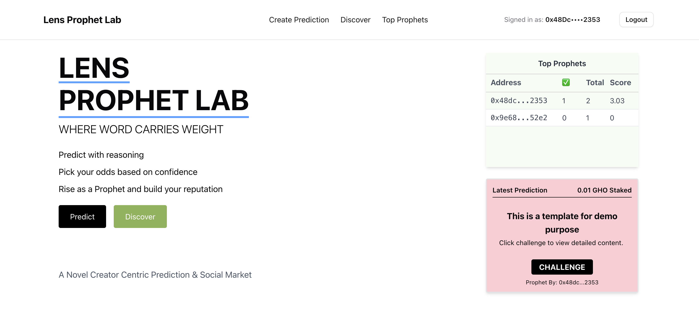

# Lens Prophet Lab

## Project Intro

### The Problem 

Every day, influencers make bold market calls — but only celebrate the wins and delete their post on lost. 

So how do we discover people who are actually good at making market calls? Lens Prophet Lab is here to change that.

We are building a novel user-centric social prediction market where the focus is the the user and the content they create, centered around predictions.

## What are we building?

Built on Lens Protocol, it’s a social prediction arena where users post future claims and reasoning — like “ETH will hit $5k by October” — and back them with real stakes. Others can challenge by placing bet against those predictions. If you’re right consistently, your reputation grows. If you're wrong, everyone sees it.

### Mechanics

But how do we ensure people are gaming the system? Here's the twist:

- Prophets can declare their "confidence level" by selecting the odd.
    - For example, if User A and B are making prediction on the same event:
        - User A Staked 0.05 ETH and allowed a minimum challenge of 0.01 ETH
        - User B Staked 0.05 ETH and only accepts a minimum challenge of 0.05 ETH
        - Then User A is considered to be more confident in their claim and will recieve a higher rating if they prophet comes true
    

Followers can challenge high-confidence claims with smaller stakes and earn a proportional share if the Prophet is wrong — flipping the social game of credibility.The more confident you are, the more you stand to lose — or gain.

We are creating a space where good prophet will get climb on the top and get their words heard.

### What's novel about this project?

## Tech Stack

- Frontend: Next Js
- Indexing : GraphQL
- Smart Contract: Hardhat
- Wallet Connection: Connect Kit + Continue with Family 
- Lens Social Primitive Used: Account & Feed (the prediction's reasoning is stored as lens feed, referenced)
- Feed Storage: Grove

### Tools and Library

- Frontend Template: https://github.com/kuhaku-xyz/lens-starter 
- Hardhat Boilerplate: https://github.com/lens-protocol/lens-network-hardhat-boilerplate

## Smart Contracts

- **Prediction Creation**: [0x9BF1Cfac8AE303Be2637bA928Ef5cb8A8E136579](https://explorer.lens.xyz/address/0x9BF1Cfac8AE303Be2637bA928Ef5cb8A8E136579)
- **Question Template Creation**: [0x48d5C7801658b29e413F343B5998c733662b24c4](https://explorer.lens.xyz/address/0x48d5C7801658b29e413F343B5998c733662b24c4)

### Prediction Resolution

We use a centralized prediction resolution system for robustness and simplicity. This means:

- A trusted operator is authorized to resolve predictions manually based on the outcome.

- To streamline/semi-automate the process, we create templates for common types of predictions (e.g., specific sports events, on-chain price action etc)

- Predictions linked to the same template can be batch resolved efficiently this way.

## Future Improvments

- Follower Social-Fi Component 
    - We may add a social-fi aspect of the game to allow good prophet can monitize their influence. Top prophet can sell their predictions or create predictions where only followers can challenge.

- More advanced scoring algorithm
    - Due to time constraint, the current scoring algorithm is quite basic. But the exsistence of template will allow us to perform custom weighting for specific questions based on the parameters in the future
        - For example we may adjust the scoring weight for price prediction based on the variance and price of each token as well. If the user's prediction is too "safe" , then it will recieve minimal weighting.
- Complex Feed Structure
    - Currently we are doing for text-only metadata uploading for feed for simplicity. In the future will may support images/commenting.
    
- 
